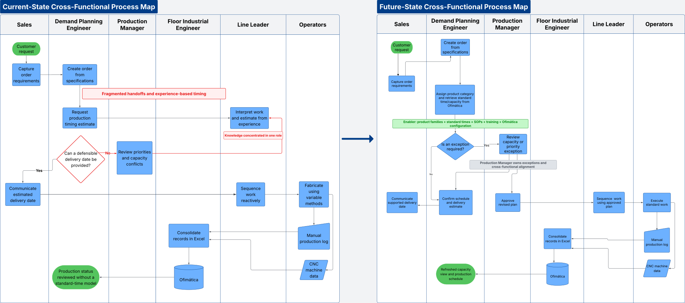
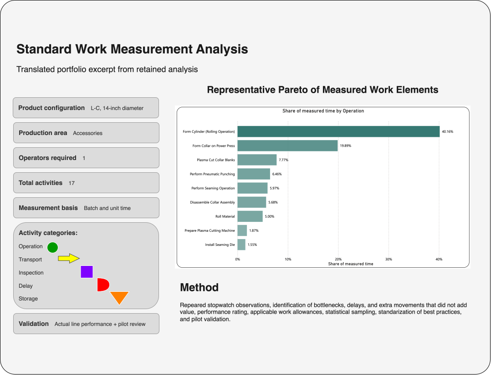
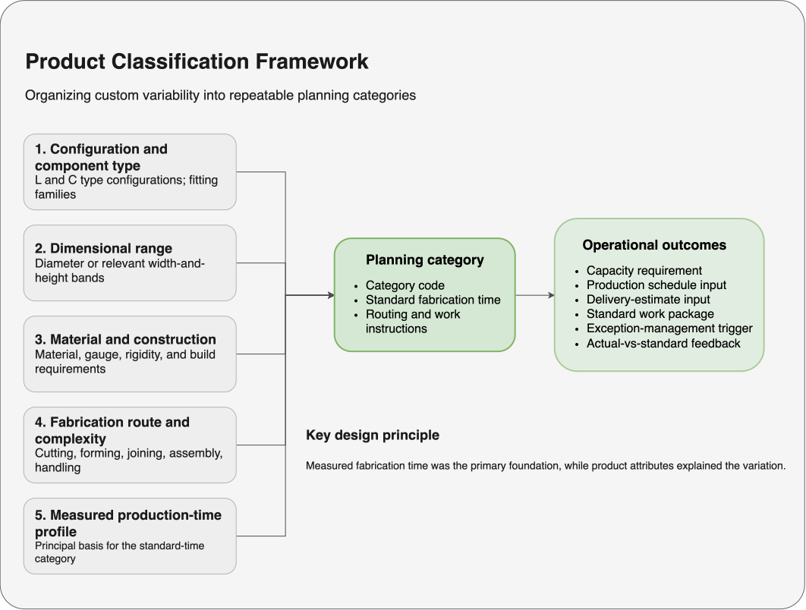
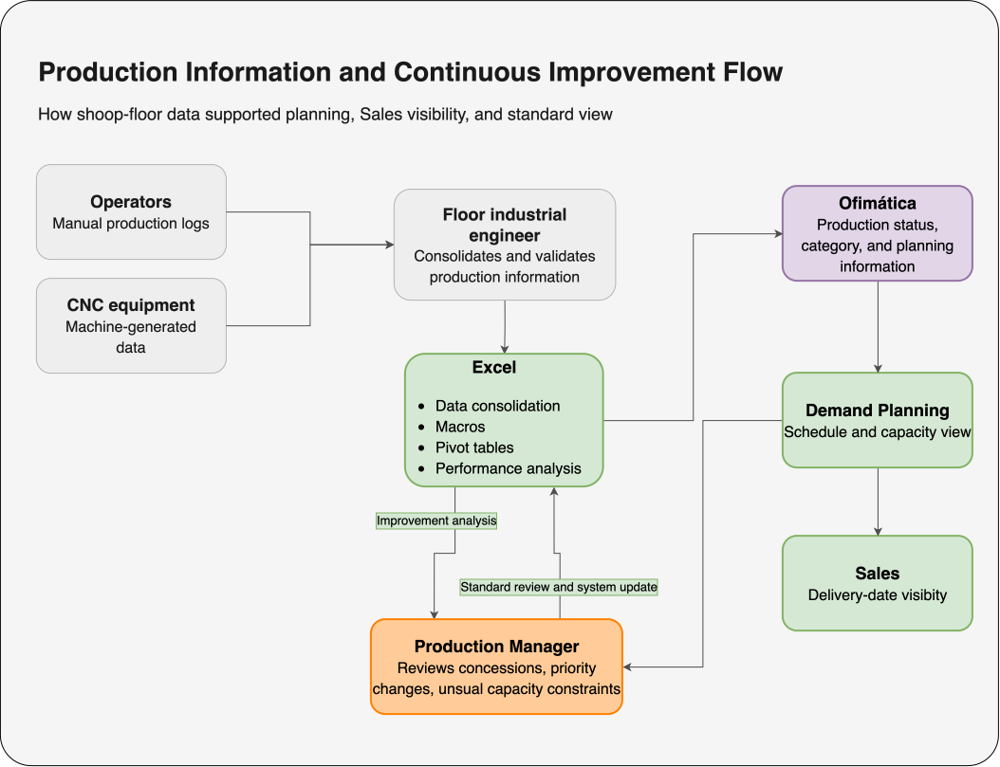

# Laminaire Process Improvement Case Study

## Standardizing Custom HVAC Fabrication to Create Capacity and Lead-Time Visibility

This case study documents a process-improvement initiative led within **Laminaire S.A.S.**, a manufacturer of HVAC and architectural products.

As **Production Manager and Process Improvement Lead**, I investigated a custom ductwork operation where delivery estimates depended heavily on line-leader experience. The objective was to convert product variability into a repeatable planning method supported by standard times, structured product categories, clearer capacity information, and improved operational visibility.

[View the full case study (PDF)](Laminaire-Process-Improvement/Laminaire-Process-Improvement-Case-Study.pdf)

---

## Business Challenge

Custom ductwork varied by configuration, dimensional range, material and construction requirements, fabrication route, and complexity.

The operation lacked a consistent way to translate those differences into standard production times and capacity requirements. As a result:

- Delivery estimates relied heavily on the line leader's experience.
- Planning knowledge was concentrated in one role.
- Sales lacked direct visibility into production capacity.
- Standard work and product-classification logic were incomplete.
- Production status and timing standards were not fully connected.

---

## Improvement Approach

The initiative combined operational leadership, industrial engineering, Lean practices, and data analysis.

Key activities included:

- Gemba investigation and direct observation
- Cross-functional process mapping
- Stopwatch time studies and work measurement
- Statistical sampling and performance-rating analysis
- Root-cause analysis
- Product-classification design
- Standard-time development
- Pilot validation
- SOP and work-instruction development
- Training and change management
- Excel-based analytical support
- Business requirements for Ofimática system changes

---

## Solution

The improvement converted custom-product variability into a structured planning model based on:

1. **Configuration and component type**
2. **Dimensional range**
3. **Material and construction requirements**
4. **Fabrication route and complexity**
5. **Measured production-time profile**

These inputs supported repeatable planning categories, standard fabrication times, routing and work instructions, capacity requirements, delivery-estimate inputs, exception-management triggers, and actual-versus-standard feedback.

---

## Operational Impact

The redesigned process shifted the operation from experience-based planning toward standardized, exception-based management.

Key outcomes included:

- Sales gained live visibility into production capacity and planned delivery information.
- Routine delivery estimates no longer required repeated consultation with the line leader.
- Demand Planning gained a repeatable method for translating product characteristics into capacity requirements.
- Production Management became involved primarily in concessions, priority changes, unusual complexity, and subcontracting decisions.
- Operational knowledge became embedded in categories, standard times, SOPs, work instructions, training materials, Excel analysis, and Ofimática.

---

## Selected Visuals

### Current-State vs. Future-State Process



### Work Measurement Analysis



### Product Classification Framework



### Production Information Flow



---

## Capabilities Demonstrated

- Operations Leadership
- Process Improvement
- Project Management
- Lean Six Sigma
- Kaizen
- Genchi Genbutsu / Gemba
- Process Mapping
- Work Measurement
- Statistical Sampling
- Root-Cause Analysis
- Standard Work
- Excel Analytics
- Pilot Validation
- Change Management
- Business-System Requirements
- Manufacturing Planning and Capacity Visibility

---

## Repository Structure

```text
Laminaire_Process_Improvement/
├── README.md
├── Laminaire_Process_Improvement_Case_Study_Final.pdf
├── index.html
├── Industrial Analysis.xlsx
├── css/
│   └── styles.css
└── visuals/
    ├── 01_before_after_process_map.svg
    ├── 02_work_measurement_analysis.svg
    ├── 03_product_classification_framework.svg
    ├── 04_production_information_flow.svg
    └── pm_flow_arrows.svg
```

### File Guide

- **`Laminaire_Process_Improvement_Case_Study_Final.pdf`** — formatted six-page case study.
- **`index.html`** — HTML version of the case study.
- **`css/styles.css`** — layout and visual styling for the HTML case study.
- **`Industrial Analysis.xlsx`** — retained analytical artifact supporting the work-measurement example.
- **`visuals/`** — process maps, analytical visuals, classification framework, and supporting diagram assets.

---

## Methods & Tools

**Methods:** Lean, Six Sigma, Kaizen, Gemba, process mapping, work measurement, statistical sampling, standard work, root-cause analysis, pilot validation, and change management.

**Tools & Systems:** Excel, Ofimática business information system, HTML/CSS, and draw.io.

---

## Case Study Note

This is a retrospective case study based on professional experience. Selected visuals and translated artifacts were recreated for portfolio use. Confidential information and unsupported financial claims are excluded.
